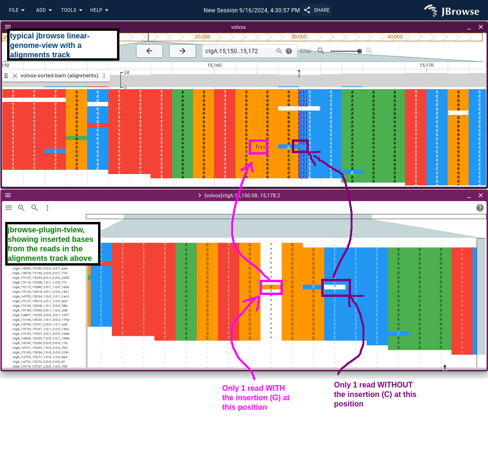

# jbrowse-plugin-tview

This plugin uses https://github.com/gmod/react-msaview for visualizing read
pileups in a `samtools tview` style interface

## Gallery

TView plugin running in JBrowse 2

## Demo

https://jbrowse.org/code/jb2/main/index.html?config=https://unpkg.com/jbrowse-plugin-tview/dist/config.json&session=share-BVmmEYAoAv&password=SuQaN
