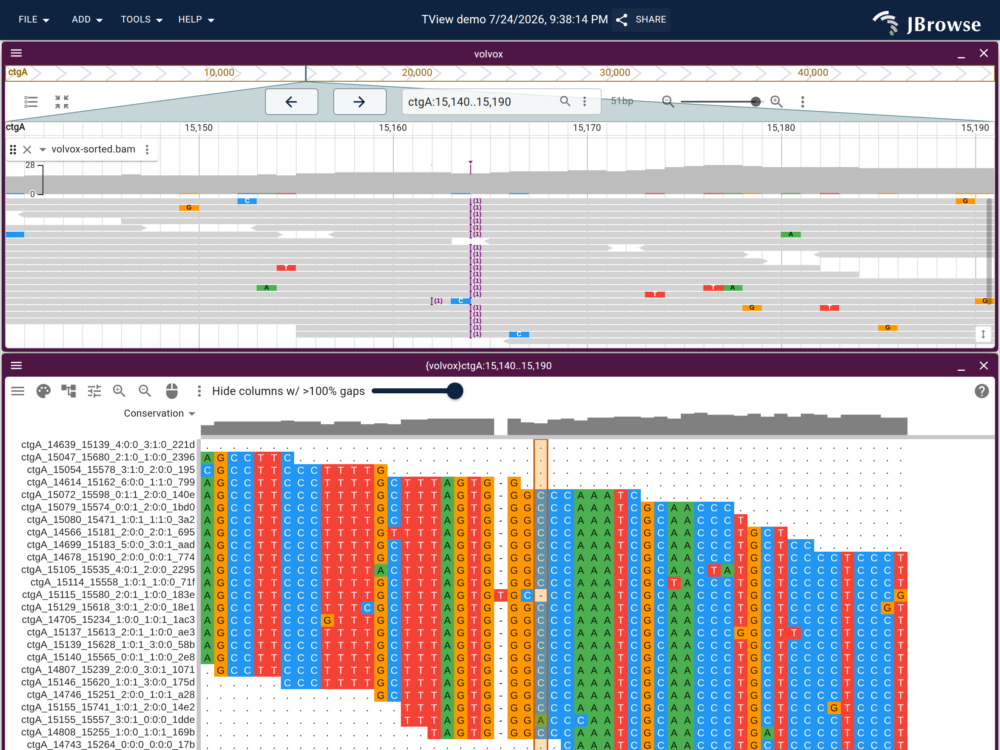
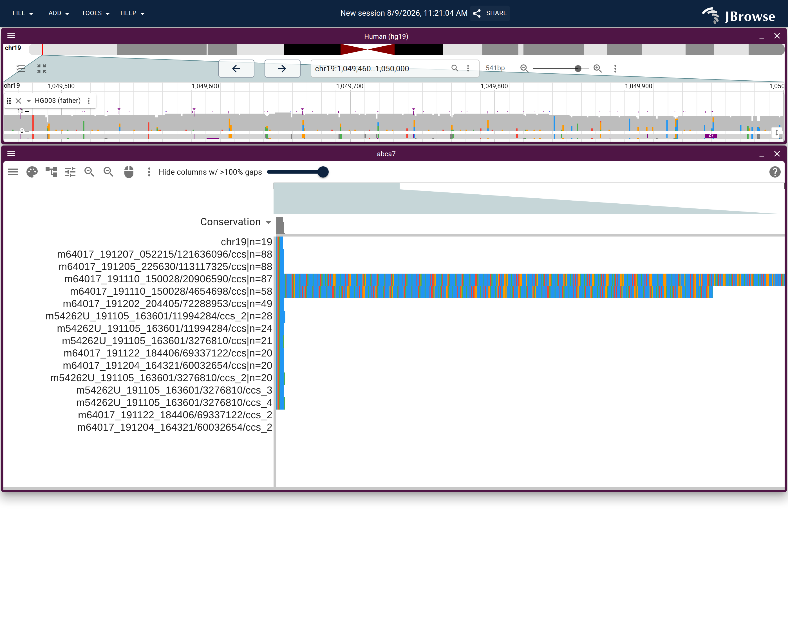
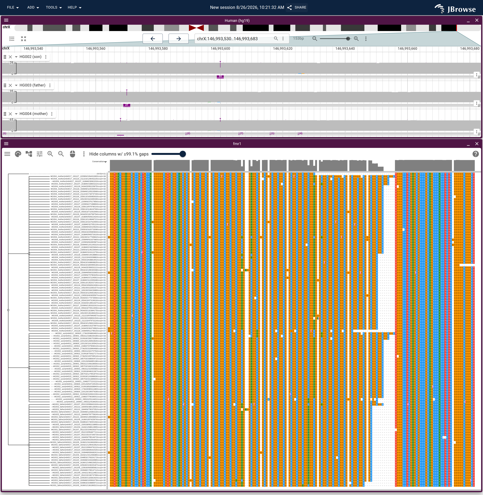

# jbrowse-plugin-tview

Loads BAM/CRAM read pileups into
[react-msaview](https://github.com/GMOD/react-msaview) for a `samtools tview`
style interface inside JBrowse 2.

Because the reads are laid out as a multiple alignment, non-reference insertions
get their own columns instead of being collapsed into a marker: every read that
inserts at a position contributes its bases, and reads without that insertion
are padded so the reference columns still line up.

## Gallery



The same reads at `ctgA:15,140..15,190`, twice. In the pileup above, the 1bp
insertion at 15,163 is collapsed into a column of purple `(1)` markers. In the
tview panel below it gets a real column (highlighted): reads carrying the
insertion show their base, reads that span the position without it show `-`, and
reads that do not cover it show `.` — so every row stays the same width and the
reference columns still line up.

Regenerate with `pnpm figure`; the tandem-repeat figures below come from
`pnpm figures:repeats`.

## How it is built

The alignment is built in an **RPC worker** (`TviewGetPlan`), so the reads never
cross to the main thread — the fetch, the pairwise alignments and the string
building all happen there and only the FASTA comes back. That is also what makes
several files one call: their rows are squared up against the same reference
interval, so an array's copies are counted once, over rows from all of them.

## Tandem repeats



The ABCA7 VNTR in one PacBio HiFi sample, a copy per block of columns. Every row
carries its copy count, and the rows sort by it, so the genotype is the step in
the ladder: two reads at 88 copies, a scatter between, and a group at 20-21.
Laid out base by base this is 2.2kb of sequence with nothing to line it up
against.

### An array is an interval, not an insertion

The array is found in the **reference**, and a row's allele is what it has
between the two ends of that interval — its matched bases, plus what it inserted
inside, minus what it deleted. Everything else follows from that:

- **The count is the allele, not the excess.** An STR is already in the
  reference, so a read's insertion is only how much more it carries than hg19
  does, and a contracted allele inserts nothing at all.
- **One locus is one array.** An indel inside an array has no unique placement,
  so an aligner anchors different reads at different positions; measured over an
  interval those choices cancel. ATXN3 in HG002 reported as four separate arrays
  when anchored on insertions, splitting one locus's alleles across four counts.
- **Every spanning read is counted**, including the ones that match the
  reference exactly — usually the commonest allele, and invisible to anything
  keyed on insertions.
- **The reference is a row.** It is laid out and counted like any other allele,
  which is what the coordinates are named after.

Nothing declares a repeat. Periods from 2 to 300bp are scanned, the shortest one
that explains a stretch wins, and a homopolymer is declined — it is periodic at
every lag and its "unit" is an arbitrary cut through one run.

At a detected array:

- **copy k of every row occupies the same block**, so one divergent copy shows
  up as a column rather than shifting every copy after it.
- **each row is labelled with its copy count** (`readname|n=32`), which is the
  measurement, rather than leaving it to be read off where the row ends.
- **rows are ordered longest allele first**, so the alleles form a ladder.
- the default column width shrinks to fit the array on screen.

**Blocks are array order, not homology.** Copies are counted from the left edge
of the interval, and arrays expand and contract anywhere inside themselves, so
the 9th copy of one row need not be the 9th copy of another. Reading down a row
is sound; reading across two is a hypothesis.

### What the numbers were checked against

`pnpm qc:repeats` runs the plan builder over the GIAB Ashkenazi trio (PacBio
HiFi, GRCh37) at known loci. Reading the per-sample modes as a genotype, every
locus with variation to check is Mendelian:

| locus         | ref | HG003 (father) | HG004 (mother) | HG002 (son) |
| ------------- | --- | -------------- | -------------- | ----------- |
| HTT (CAG)     | 33  | 31 / 31        | 31 / 38        | 31 / 38     |
| ATXN3 (CTG)   | 8   | 8 / 17         | 8 / 8          | 8 / 17      |
| TCF4 CTG18.1  | 38  | 25 / 46        | 28 / 38        | 28 / 46     |
| DMPK (CTG)    | 21  | 12 / 14        | 6 / 12         | 12 / 12     |
| FMR1 (CGG), X | 21  | 30             | 31 / 32        | 32          |

FMR1 is the one that cannot be right by accident: nothing tells the layout which
chromosome it is on, and the two males come back with one allele each and the
mother with two, with the son's allele one of hers.

### Where it is weaker

- **The interval is what scans as periodic, not a curated locus definition.**
  Where a locus runs two related units together — HTT's CAG tract and the CCG
  tract after it are both period 3 — they are one array, the count spans both,
  and it will not match a published CAG size.
- **A few reads per locus land off the mode.** HG004 at ATXN3 is 8/8 on 47 of 51
  spanning reads, with 3 reads at 21. Read the distribution, not one row.
- **Long VNTR alleles are noisy.** ABCA7's expanded haplotype in HG003 comes
  back as 87, 88, 88 on three reads but also 49 and 58 on two more; a 2.2kb
  array of a 25bp unit is where slippage in the read and in the aligner both
  show up.
- **Coverage thins with array length**, because a row is only counted if it
  spans the interval end to end: 123 spanning reads at FMR1's 62bp array, 11 at
  ABCA7's 466bp one.

### Several samples at once



The FMR1 CGG repeat in the GIAB Ashkenazi trio, all three files in one
alignment. Rows are grouped into a clade per sample by a synthetic tree, which
turns on react-msaview's collapse and show-only controls for free.

The copy numbers are checkable, which is the point of this locus: FMR1 is on the
X, so the two male samples come back with one allele each (HG002 32, HG003 30)
and the mother with two (31 and 32) — and the son's single allele is one of his
mother's, as an X-linked allele has to be.

## Usage

- Install the plugin
- Open the track menu (vertical `...`) on an alignments track
- Click "Launch tview for visible region"
- Tick any other open alignments track to fold its reads into the same alignment

The launched view stays connected to the genome view it came from: hovering or
clicking an alignment column highlights the corresponding genome position, and
clicking navigates there. "Zoom to base level on click?" in the view menu
switches between centering and zooming.

The visible region is capped at 20kb, since one column per base gets unwieldy
beyond that.

### As a session, with no click path

A tview is a locus, an assembly and the files to read it from, so it can be
declared rather than driven. In a `defaultSession` or a saved session that is
the view's `init` block:

```json
{
  "type": "TView",
  "init": {
    "assembly": "hg19",
    "loc": "chrX:146,993,530..146,993,670",
    "tracks": [
      { "trackId": "HG002", "sample": "HG002_son" },
      { "trackId": "HG003", "sample": "HG003_father" }
    ]
  }
}
```

A [session spec](https://jbrowse.org/jb2/docs/urlparams/) URL takes the same
keys **flat** — that is the one shape difference, and it is JBrowse's, not this
plugin's:

```json
{
  "type": "TView",
  "assembly": "hg19",
  "loc": "chrX:146,993,530..146,993,670",
  "tracks": ["HG002"]
}
```

Either way the view resolves it itself, which is also how a restored session
gets its alignment back: react-msaview drops an MSA over 50kb from snapshots and
there is no file to reload from, so `init` is what persists.

`public/repeats.json` is a working example — the GIAB trio on hosted hg19, with
a tview at FMR1 open on load.

## Requirements

Needs a JBrowse build shipping `@jbrowse/core` >=4.3 with MUI 9 — currently
jbrowse-web nightly. On JBrowse 4.3.0 the bundle fails to load, because
react-msaview 5.x needs `@jbrowse/mobx-state-tree` 5.13 APIs and MUI 9 icon
internals that the 4.3.0 release does not ship.

## Development

```bash
pnpm install
pnpm start            # dev server on :9000, serves dist/out.js with CORS
pnpm test             # unit tests
pnpm test:e2e         # puppeteer tests (creates .test-jbrowse on first run)
pnpm lint
pnpm build

pnpm figures:repeats  # the tandem-repeat figures in img/
pnpm qc:repeats       # copy numbers at known loci, from live GIAB data
```

`qc:repeats` is not a test. It fetches from GIAB and UCSC and prints what the
plan builder measured at each locus, per sample, so the numbers can be read
against what the locus is known to carry — Mendelian consistency across the
trio, hemizygosity on the X, published allele ranges. The loci and samples live
in `test/liveRepeatsData.ts`.

`pnpm start` serves the repo root, so a JBrowse instance unpacked at
`.test-jbrowse` can load the plugin from the same origin via
`http://localhost:9000/.test-jbrowse/index.html?config=../public/config.json`.
